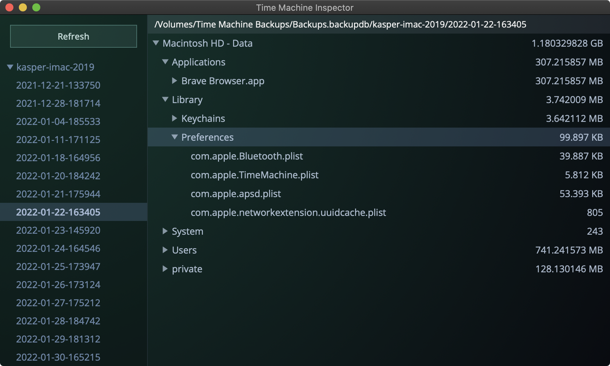

  

<h3 align="center">Time Machine Inspector</h3>

  Find out what's hogging up your backups
   
  <a href="https://github.com/probablykasper/time-machine-inspector/releases"><b>Download for Mac</b></a>

 

## Dev instructions

### Get started

1. Install Node.js
2. Install Rust
3. Follow the [Tauri setup guide](https://tauri.studio/en/docs/getting-started/intro)
4. Run `npm install`

### Commands
- `npm run dev`: Start app in dev mode
- `npm run build`: Build
- `npm run format`: Format
- `npm run check`: Check code

### Release new version
1. Update `CHANGELOG.md`
2. Manually bump the version number in `src-tauri/Cargo.toml`
3. Run `npm run check` to make sure `Cargo.lock` is up to date
4. Commit with a tag in the format `v#.#.#`
5. Add release notes to the generated GitHub release and publish it
